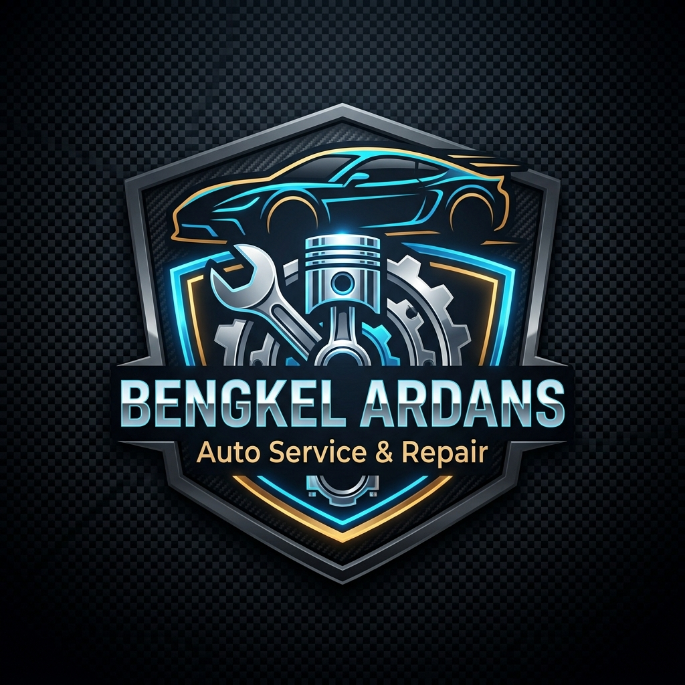

<div align="center">

# 🚗 Bengkel Mobil Ardans - Web Portal & Sistem Kasir POS



**Portal Layanan Publik Bengkel Mobil, Pelacak Servis Mandiri (*Privacy-Safe*), & Sistem Manajemen Operasional POS.**  
*Dibangun dengan Pure Native PHP (PDO), MySQL, HTML5, CSS3 Modern Dark-Slate, dan Vanilla JavaScript (Zero Framework Overhead).*

[](https://php.net)
[](https://mysql.com)
[](assets/css/style.css)
[](LICENSE)

</div>

---

## 📖 Sekilas Tentang Proyek

**Bengkel Mobil Ardans** adalah sistem web otomotif terpadu dua sisi (*two-sided platform*):
1. **Sisi Publik (Pengunjung & Pelanggan)**: Menyajikan profil bengkel, katalog jasa servis terkoneksi database, jam operasional buka/tutup dinamis real-time, showcase brand suku cadang OEM resmi, serta pelacak status servis mandiri berstandar keamanan data pribadi (*privacy-safe*).
2. **Sisi Internal (Kasir, Mekanik, & Admin)**: Menyediakan pusat kendali transaksi kasir *point-of-sale*, manajemen antrean servis, pemotongan stok suku cadang otomatis berbasis transaksi ACID, pencatatan master data, hingga panel kontrol operasional bengkel.

---

## 🌟 Fitur Unggulan

### 1. 🌐 Halaman Depan Publik (Landing Page)
* **Emblem & Identitas Bengkel**: Tampilan visual resmi Bengkel Ardans dengan tema *Dark Slate* yang elegan, responsif, dan nyaman di mata.
* **🟢 Jam Operasional Real-Time**:
  * Jam buka reguler **08:00 - 16:00 WIB** (Senin - Sabtu).
  * **Otomatis Libur** setiap hari Minggu dan tanggal merah (hari libur nasional Indonesia).
  * Dilengkapi *pulsing animated status dot* (Buka Sekarang, Sedang Tutup, Libur Hari Minggu, Libur Tanggal Merah).
  * Dapat dioverride secara fleksibel oleh admin (*Buka Paksa/Lembur*, *Tutup Sementara*, atau *Libur Mendadak*) lengkap dengan banner pesan pengumuman.
* **🔍 Cek Status Servis Mandiri (*Privacy-Safe*)**:
  * Pelanggan cukup memasukkan **ID Nota** (misal: `TRX-20260905-001`).
  * **100% Bebas Kebocoran Data**: Tidak menampilkan nama pelanggan, no telepon, alamat, maupun plat nomor kendaraan.
  * Menampilkan *Visual Stepper Progress* (1. Mobil Diterima $\rightarrow$ 2. Dikerjakan Mekanik $\rightarrow$ 3. Servis Selesai & Siap Diambil), status pembayaran (Lunas / Belum Lunas), catatan teknisi, dan tombol konsultasi WhatsApp.
* **🛠️ Katalog Layanan Dinamis**: Menampilkan daftar ongkos jasa dan estimasi waktu pengerjaan yang diambil langsung dari database `layanan`.
* **🏷️ Showcase 14 Brand Suku Cadang Resmi (SVG Vektor Asli)**:
  * Logo resmi pabrikan: *Toyota, Daihatsu, Honda, Mitsubishi, Suzuki, Nissan*.
  * Pelumas & oli resmi: *Shell Helix, Castrol, Pertamina Fastron, Mobil 1*.
  * Komponen & kelistrikan: *Denso, Bosch, NGK Spark Plugs, Bendix Brakes, GS Astra*.
  * Dilengkapi klausul *Nominative Fair Use* (Trademark Disclaimer).
* **📍 Lokasi, Kontak & Konsultasi**:
  * Tombol interaktif chat langsung ke WhatsApp Customer Service.
  * Peta lokasi workshop responsif via Google Maps.
* **🔒 Akses Karyawan & Admin di Footer**:
  * Navbar atas murni untuk pengunjung publik. Link login admin ditempatkan secara rapi dan tersembunyi di bagian paling bawah (*footer*).

---

### 2. 💼 Sistem Manajemen Operasional (Internal Staff)
* **📊 Dashboard Pusat Kendali (`dashboard.php`)**: Memantau metrik omzet, mobil yang sedang dikerjakan montir, antrean servis, dan peringatan dini stok menipis (*minimum stock alert*).
* **⚙️ Panel Pengaturan Bengkel (`pengaturan.php`)**: Konfigurasi jadwal operasional, toggle buka/tutup/libur mendadak, pesan pengumuman, dan nomor WhatsApp resmi tanpa mengubah kodingan.
* **🛒 Kasir Servis & POS (`kasir.php`)**: Buka surat perintah kerja baru dengan penomoran invoice otomatis unik (`TRX-YYYYMMDD-XXX`), odometer KM, dan keluhan pelanggan.
* **⚖️ Transaksi Stok ACID (`detail_transaksi.php`)**:
  * Pasang jasa servis dan suku cadang secara dinamis.
  * Stok suku cadang otomatis terpotong saat dipasang, dan otomatis kembali jika item dibatalkan.
  * Pembayaran kasir dengan validasi ketat (nominal cukup, hitung kembalian otomatis, bebas nilai negatif).
* **🖨️ Cetak Nota Kasir Resmi (`cetak_nota.php`)**: Desain struk transaksi rapi yang ramah cetak printer kasir maupun ekspor PDF (`@media print`).
* **👥 Manajemen Master Data Terpadu (CRUD Lengkap)**:
  * Data Pelanggan (`pelanggan.php`)
  * Data Mobil Pasien (`kendaraan.php`)
  * Stok Suku Cadang & Gudang (`sparepart.php`)
  * Katalog Ongkos Jasa Servis (`layanan.php`)
  * Data Teknisi Mekanik & Status Kerja (`mekanik.php`)

---

## 🛡️ Arsitektur Keamanan & Standar Koding (Security-First)

* 🔒 **100% Prepared Statements (PDO)**: Seluruh interaksi database menggunakan parameter binding bawaan PDO untuk menjamin sistem **kebal terhadap SQL Injection**.
* 🔑 **Bcrypt Password Hashing**: Kredensial pengguna dienkripsi dengan algoritma standar industri Bcrypt (`password_hash` & `password_verify` cost 12).
* 🛡️ **Session Fixation Prevention**: Fungsi `session_regenerate_id(true)` otomatis dipanggil saat proses autentikasi berhasil.
* 🧼 **Strict Output Escaping (Anti-XSS)**: Setiap variabel yang ditampilkan ke HTML dibungkus melalui helper fungsi `e()` (`htmlspecialchars`).
* 🔁 **Smart Database Fallback**: Koneksi database otomatis mengenali konfigurasi lingkungan lokal WSL2 Linux maupun Laragon/XAMPP di Windows tanpa konfigurasi manual.

---

## 📁 Struktur Direktori Proyek

```text
Bengkel-Mobil/
│
├── assets/
│   ├── css/
│   │   └── style.css            # Sistem Desain Dark-Slate, Token UI, & Responsive Layout
│   └── img/
│       ├── logo.png             # Logo Resmi Bengkel Mobil Ardans
│       └── brands/              # Koleksi 14 Logo Vektor SVG Resmi
│           ├── toyota.svg
│           ├── daihatsu.svg
│           ├── honda.svg
│           ├── mitsubishi.svg
│           ├── suzuki.svg
│           ├── nissan.svg
│           ├── shell.svg
│           ├── castrol.svg
│           ├── pertamina.svg
│           ├── denso.svg
│           ├── bosch.svg
│           ├── ngk.svg
│           ├── bendix.svg
│           └── gs-astra.svg
│
├── config/
│   └── database.php             # Koneksi PDO (Singleton), Helper Anti-XSS, Helper Jam Buka & Status
│
├── database/
│   └── db_bengkel_mobil.sql     # Skema Database 10 Tabel Relasional Lengkap & Seed Data Pengujian
│
├── includes/
│   ├── auth.php                 # Guard validasi sesi login pengguna
│   ├── header.php               # Template navigasi atas staf (Dashboard, Kasir, Master Data)
│   └── footer.php               # Template footer staf & script bundle Bootstrap
│
├── index.php                    # [PUBLIK] Landing Page Resmi, Profil, Katalog Layanan & Pelacak Servis
├── dashboard.php                # [STAFF] Pusat Kendali Operasional Kasir & Monitoring Antrean
├── pengaturan.php               # [ADMIN] Panel Pengaturan Jadwal Buka/Tutup & Libur Mendadak
├── kasir.php                    # [STAFF] Formulir Pendaftaran Servis / Work Order Baru
├── detail_transaksi.php         # [STAFF] Kelola Jasa, Sparepart, Kasir Pembayaran & Stok ACID
├── transaksi.php                # [STAFF] Riwayat Seluruh Transaksi & Filter Status
├── cetak_nota.php               # [STAFF] Template Cetak Nota Invoice Transaksi
│
├── pelanggan.php                # CRUD Data Pelanggan
├── kendaraan.php                # CRUD Data Mobil Pasien
├── sparepart.php                # CRUD Inventaris Suku Cadang & Kontrol Stok
├── layanan.php                  # CRUD Katalog Jasa Servis
├── mekanik.php                  # CRUD Data Teknisi Montir
│
├── login.php                    # Halaman Login Staf Bengkel (Prepared Statement & Bcrypt)
├── logout.php                   # Penghancuran sesi login aman & redirect
├── .gitignore                   # Konfigurasi proteksi file rahasia, cache, dan artifact
└── README.md                    # Dokumentasi lengkap sistem
```

---

## 🛠️ Panduan Instalasi & Menjalankan Aplikasi

### 1. Prasyarat Lingkungan
* **PHP**: Versi 8.1 atau yang lebih baru (ekstensi `pdo_mysql` aktif).
* **Database**: MySQL 8.0+ atau MariaDB 10.4+.
* **Web Server**: Apache / Nginx / PHP Built-in Server.

---

### 2. Langkah Instalasi (Linux WSL2 / Ubuntu)

1. **Clone Repositori:**
   ```bash
   cd ~
   git clone https://github.com/ardans-dev/Bengkel-Mobil.git
   cd Bengkel-Mobil
   ```

2. **Import Database MySQL:**
   ```bash
   mysql -u root -p < database/db_bengkel_mobil.sql
   ```
   *(Atau masukkan melalui user MySQL aktif Anda, misal: `mysql -u ardans -padmin123 < database/db_bengkel_mobil.sql`)*

3. **Jalankan Server Lokal PHP:**
   ```bash
   php -S localhost:8080
   ```

4. **Buka di Browser:**
   * **Halaman Depan Publik**: [http://localhost:8080/](http://localhost:8080/)
   * **Login Staf & Admin**: [http://localhost:8080/login.php](http://localhost:8080/login.php)

---

### 3. Langkah Instalasi (Windows - Laragon / XAMPP)

1. Clone atau salin folder `Bengkel-Mobil` ke direktori web server Anda:
   * **Laragon**: `C:\laragon\www\Bengkel-Mobil`
   * **XAMPP**: `C:\xampp\htdocs\Bengkel-Mobil`
2. Buka **phpMyAdmin** atau **DBeaver**, lalu jalankan file SQL `database/db_bengkel_mobil.sql`.
3. Akses via browser: `http://localhost/Bengkel-Mobil/`

---

## 🔑 Kredensial Pengguna Bawaan (Default Login)

Sistem sudah dilengkapi dengan akun pengujian siap pakai:

| Level Hak Akses | Username | Password Bawaan | Tujuan Penggunaan |
| :--- | :--- | :--- | :--- |
| **Admin Bengkel** | `admin` | `admin123` | Akses penuh ke seluruh fitur, Master Data, & Pengaturan Operasional |
| **Kasir Servis** | `kasir` | `kasir123` | Akses operasional harian: Buka tiket servis, kelola transaksi, & cetak nota |

---

## 🧪 Pengujian & Jaminan Kualitas (Test Suites)

Aplikasi telah divalidasi melalui 4 tingkat rangkaian uji otomatis:
* **`test_landing_page.py`** (4/4 PASS): Verifikasi tampilan halaman publik, integrasi 14 brand SVG resmi, pemenuhan zero-leak PII pada tracker mandiri, dan pergantian mode operasional real-time.
* **`test_http_e2e.py`** (10/10 PASS): Verifikasi *user-journey* kasir dari pendaftaran kendaraan, pemasangan sparepart, pemotongan stok otomatis, hingga pelunasan nota invoice via HTTP.
* **`test_crud_http.py`** (5/5 PASS): Verifikasi kelengkapan operasi Create, Read, Update, Delete untuk seluruh modul master data.
* **`test_suite.php`** (31/31 PASS): Verifikasi engine backend PDO, integritas skema tabel, keamanan enkripsi Bcrypt, dan rollback ACID.

---

## 📄 Lisensi & Hak Cipta

* Seluruh kode sumber sistem berlisensi di bawah **MIT License**.
* Logo resmi, merek dagang, dan nama produk kendaraan (*Toyota, Daihatsu, Honda, Shell, dll.*) adalah hak milik dari masing-masing pemegang merek resmi (*Nominative Fair Use*).

---

<div align="center">

Dibuat dengan dedikasi untuk keunggulan operasional bengkel oleh **[Ahmad Yardan Rasika](https://github.com/ardans-dev)**.

</div>
